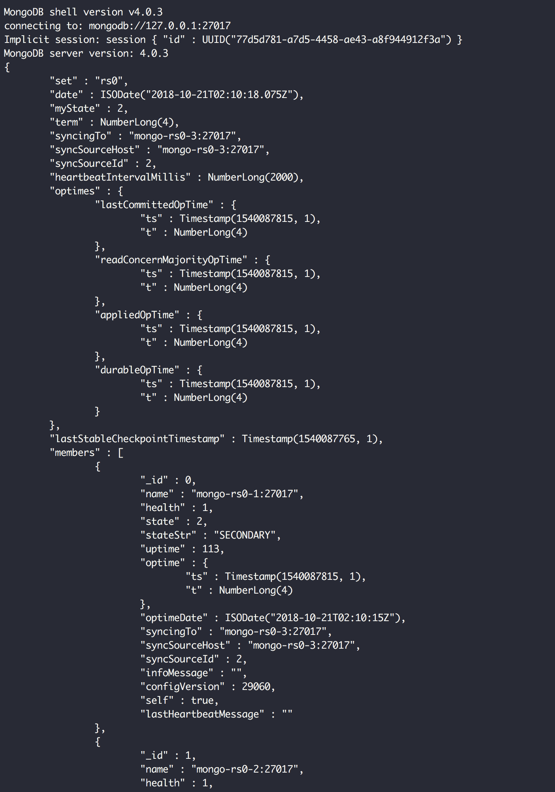

# MongoDB replica set

Simple MongoDB replica set docker compose file.

In order to use Transaction function in MongoDB, you need a set of a replicated databases named MongoDB replica set.

This project makes it easy to build a MongoDB replica set circumstances by using docker container.

## Requirements

This project uses a Docker container for virtualizing Database circumstances.
Therefore, **Docker** must be installed

## Installation

Pull all the necessary docker image from docker hub and set up replica set configuration

```bash
docker-compose up
```

## Setup database

You need to make your own data base.

### Check which server is Primary node

```bash
docker exec mongodb-replica-set_mongo-rs0-1_1 bash -c 'mongo --eval "rs.status()"'
```

result


In members field you can find member who has "PRIMARY" in "stateStr" field, and that is a Primary Node

### Enter docker container which serves Primary MongoDB Server

After you have successfully found out which container is serving primary node, you can enter that container by below command

```bash
docker exec -it _container_that_serves_primary_node_ bash
```

### Create Account

Create Admin Account

```bash
mongo
use admin
db.createUser({user: "root", pwd: "test1234", roles: [{ role: "root", db: "admin" }] });
```

Create Database and matching account

```bash
mongo
use testdb
db.createUser(
 { user: "test",
 pwd: "test1234",
 roles: ['readWrite','userAdmin'] } )
```

### Login to the created database

```bash
mongo -u test -p test1234 testdb
```
